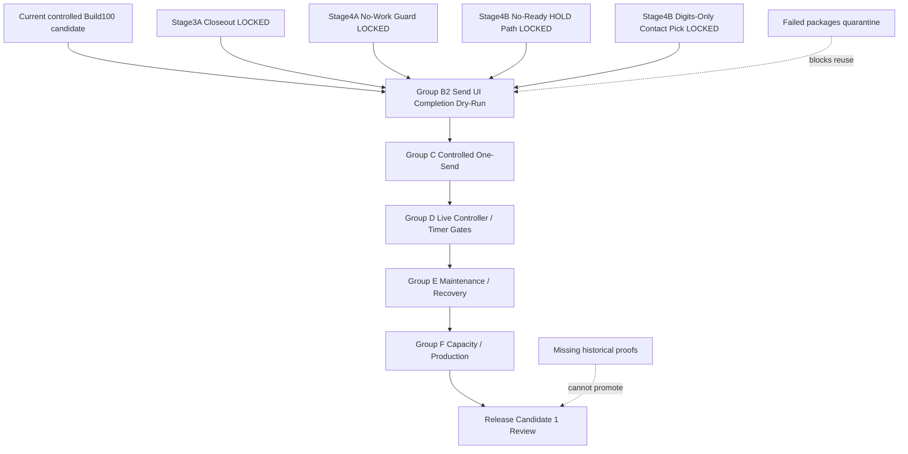

# AI Worker Release Dependency Graph

Updated: 2026-07-05

## Status

`CANDIDATE / HOLD FOR CHATGPT AUDIT`

## Dependency Graph

## Gate Order

1. Group B2 must pass before any controlled one-send.
2. Group C must pass before timer/live.
3. Group D must pass before archive/deadarchive/compactor/TT5.
4. Group E must pass or stay disabled before capacity proof.
5. Group F is last and cannot override the one-send rule.

## Shortest Safe Path To RC1

- Finish Group B2 dry-run UI completion.
- Run one isolated controlled-send proof.
- Prove live controller gates without expanding send count.
- Keep maintenance paths held unless explicitly tested.
- Run capacity proof last with one-send-per-cycle still enforced.
